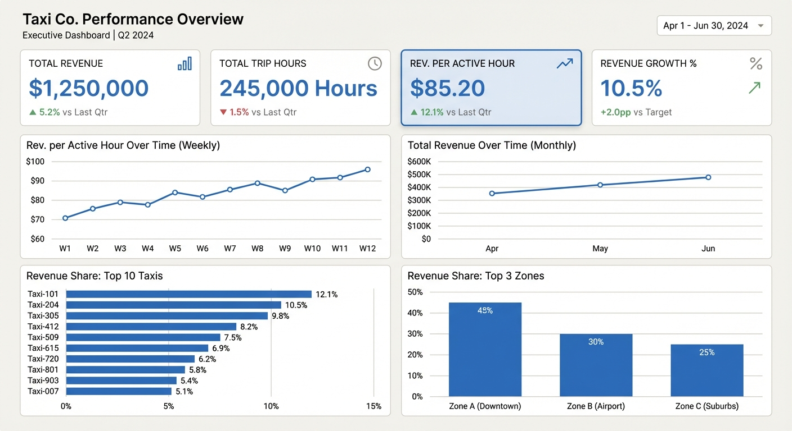

# WindyCity Cabs — End-to-End Data Pipeline

## Objetivo

Diseñar e implementar un flujo end-to-end de datos desde una API pública (Chicago Taxi Trips – Socrata) hasta dashboards ejecutivos y operacionales, demostrando:

- Capacidad técnica de implementación
- Razonamiento de negocio
- Modelado analítico
- Métricas accionables
- Reproducibilidad

## Arquitectura del Pipeline

mermaid
flowchart TD
    A[Socrata API] --> B[Raw Layer JSONL]
    B --> C[Staging Layer Parquet]
    C --> D[MySQL stg_trips]
    D --> E[Analytical Marts]
    E --> F[CSV Exports]
    F --> G[Dashboards Tableau]

## Stack Tecnológico

- Lenguaje: Python
- Base de datos: MySQL 8 (Docker)
- Librerías: pandas, SQLAlchemy, pymysql
- Orquestación simple: run.py
- Visualización: Tableau Public

## Cómo ejecutar el proyecto
Requisitos:

Docker instalado

Python 3.10 o superior

### 1. Clonar el repositorio

git clone https://github.com/jmontecino88/windycity-cabs-pipeline.git
cd windycity-cabs-pipeline

### 2. Configurar entorno

copy .env.example .env

### 3. Levantar MySQL

docker compose up -d

### 4. Ingesta incremental

python run.py ingest

### 5. Staging

python run.py stage

### 6. Carga en MySQL

python run.py load

### 7. Construcción de marts

python run.py transform

### 8. Export para BI

python run.py export

## Modelo de Datos

Tabla base:
- stg_trips (granularidad: 1 fila = 1 viaje)

Llave primaria:
- business_key (SHA256 hash)

Campos derivados:
- trip_date
- trip_hour
- weekday
- is_weekend

Tablas analíticas:
- daily_kpis
- hourly_kpis
- taxi_daily_kpis
- zone_daily_kpis
- executive_kpis
- payment_mix_daily

## Métricas de Negocio

### Revenue per Active Hour (Proxy de eficiencia)

total_revenue / (total_trip_seconds / 3600)

Permite medir:
- Productividad real
- Mix de precios
- Eficiencia operativa

---

Otras métricas:

- Total Revenue
- Total Trip Hours
- Avg Revenue per Trip
- Avg Trip Duration
- Revenue share top 10 taxis
- Revenue share top 3 zones
- Payment mix %

## Dashboards – Imágenes de respaldo (fallback)

"En caso de falla del enlace público, se incluyen imágenes de respaldo."

### Dashboard 1 — Dirección | Performance Global

Tablas utilizadas:

daily_kpis

executive_kpis
### Dashboard 2 — Dirección | Riesgo & Mix

Tablas utilizadas:

taxi_daily_kpis

zone_daily_kpis

payment_mix_daily

executive_kpis
---

### Dashboard 3 — Operación | Eficiencia
Dataset:
- hourly_kpis

Link público:
https://public.tableau.com/views/TaxiFleetOperationalEfficiency1/Main

---

### Dashboard 4 — Operación | Flota & Conductores

Tablas utilizadas:

taxi_daily_kpis

## Decisiones Técnicas

- Incrementalidad con watermark + lookback 6h
- Deduplicación por business_key
- Rebuild completo de marts (DROP + CREATE)
- Upsert idempotente en MySQL
- Agregaciones SQL-side (evita lógica duplicada en Python)

Trade-offs:
- No se implementó orquestador externo
- No se implementaron tests automatizados
- No se implementó monitoreo formal

## Uso de IA

Se utilizó asistencia de modelos de lenguaje para:

- Estructuración del pipeline
- Revisión de lógica incremental
- Definición de métricas
- Diseño conceptual de dashboards
- Documentación

Toda la implementación fue validada y ejecutada manualmente.

## Backlog / Próximos pasos

- Tests automáticos
- CI básico
- Data quality framework formal
- Orquestación con Prefect o Airflow
- Monitoreo de freshness
- Modelado dimensional más formal (star schema)
